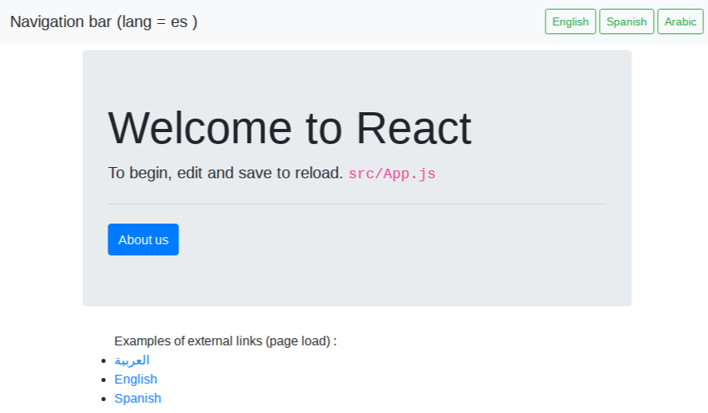
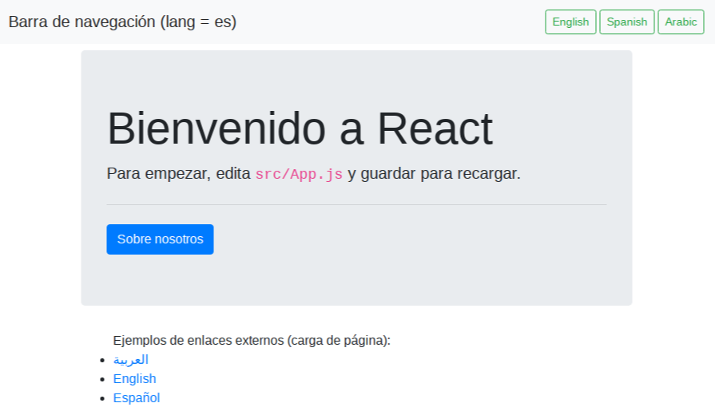
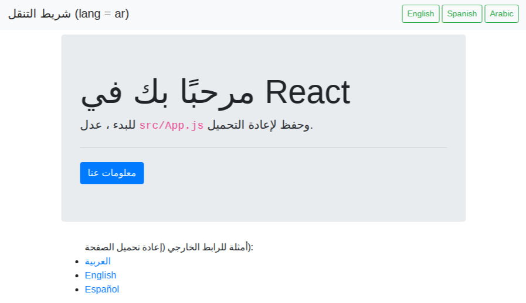

## React Internationalization Demo

## Install

- `npm install`
- `npm start`

## i18n

Build message files without destroying existing language mappings.

This is a process repeated as you build up the site content.

- `rm -f src/i18n/messages/messages.json src/i18n/locales/en.json && yarn extract:messages && yarn manage:translations`

